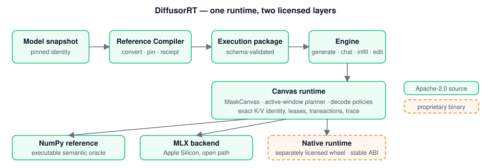

<div align="center">


<h1>DiffusorRT</h1>

<p><strong>Diffusion language model inference for edge devices.</strong></p>

<p>
DiffusorRT is a cross-platform, edge-first, dLLM-native inference and deployment
runtime for diffusion language models on Macs, single PCs and workstations, and
mobile or embedded devices. Apple Silicon with MLX is the first validated
product slice, not the platform boundary.
</p>

<p>
<a href="https://www.apache.org/licenses/LICENSE-2.0"></a>


</p>

<p>
<a href="#why-diffusorrt">Why</a> ·
<a href="#news">News</a> ·
<a href="#features">Features</a> ·
<a href="#supported-models">Models</a> ·
<a href="#platforms">Platforms</a> ·
<a href="#getting-started">Getting Started</a> ·
<a href="#architecture">Architecture</a> ·
<a href="#roadmap">Roadmap</a> ·
<a href="#documentation">Docs</a> ·
<a href="#citation">Citation</a> ·
<a href="#license">License</a>
</p>

</div>

## Why DiffusorRT

Diffusion language models do not decode left to right. They refine a whole
canvas of tokens in parallel, fill holes in the middle of a document, revise a
span, and commit several positions per step. Engines built for autoregressive
decoding hide all of that behind a token stream, and they assume a server.
DiffusorRT is built for the model class and for the device on your desk:

- **Edge-first.** Optimized for one user or a few local sessions on a single
  device, with memory bounded and every failure fail-closed.
- **Cross-platform.** One runtime and one package contract; platform-specific
  backends attach through a stable ABI.
- **dLLM-native.** The control plane models a mutable canvas: `generate`,
  multi-turn `chat`, bidirectional `infill`, span `edit`, parallel unmasking,
  and remasking share one Engine and one runtime session.
- **Exact by default.** Active-window execution forwards only the rows that
  still need evidence and keeps the full forward as its oracle; reduced
  execution reaches the product only after it matches the oracle token for
  token.
- **One-command deployable.** `doctor`, `pull`, `run`, and `serve` take a
  supported model from selection to a healthy local runtime without a source
  tree.
- **Open SDK, optimized engine.** The Apache-2.0 SDK and reference runtime stay
  runnable and useful for integration, correctness, and conformance;
  production-optimized native runtimes ship as separately licensed binaries.

DiffusorRT does not claim that diffusion models beat autoregressive models in
tokens per second. Every performance statement names its model, hardware,
precision, and cache state.

## News

- **2026-09-01 — Exact-D2F now runs on the native K/V manager.** The Apple/MLX
  product path drives the compiled cache manager as its only persistent K/V
  owner, with admission before allocation, transactional publication, and
  checked shutdown through `Engine.close()`. The installed product evidence
  binds the Apache-2.0 SDK and the separately licensed runtime wheel to the
  same source identity.
  [Details →](./docs/product/kv-cache-manager-v1.md)
- **2026-08-24 — The private CUDA provider executes real Dream BF16 windows.**
  The provider built and installed on Linux, preserved the 11-symbol callable
  surface, and passed the seven-window numerical gate on A100 and L40. The
  public runtime still refuses CUDA; this is a foundation, not a product claim.
  [Details →](./docs/product/cuda-runtime-v1.md)
- **2026-08-20 — Qwen3-MDLM v0.1 completed product admission.** The exact 0.6B
  revision passed reproducible parity and capability gates and the installed
  `doctor`, `pull`, `list`, `run`, and `serve` workflow on Apple M4 Max with
  MLX fp32.
  [Details →](./docs/product/model-coverage-v1.md)
- **2026-08-15 — The native C++ boundary runs a real Dream window.** The
  callable runtime builds as a binary wheel and agrees with the Python/MLX
  oracle on row order, argmax, and top-5.
  [Details →](./docs/product/callable-runtime-v1.md)
- **2026-08-13 — One command reaches a model from an empty cache.** `run`,
  `pull`, `list`, `doctor`, and `serve` accept the pinned model ID and complete
  acquisition, compilation, loading, and generation.
  [Details →](./docs/product/client-runtime-v1.md)

See [Product Updates](./docs/product/CHANGELOG.md) for completed milestones,
removals, compatibility notes, and scope limits.

## Features

| | |
|---|---|
| **Canvas operations** | One Engine exposes `generate`, multi-turn `chat`, bidirectional `infill`, and span `edit`. |
| **Exact work reduction** | Active-window D2F executes only rows that still need evidence and keeps the full forward as its oracle. |
| **One K/V owner** | A native cache manager owns identity, capacity, leases, transactions, and a versioned operation trace; the Python manager is its differential oracle. |
| **Model-addressable workflow** | `doctor`, `pull`, `run`, `list`, and `serve` resolve the supported model without a package path. |
| **Execution packages** | The Reference Compiler pins source identity, checks disk cost, converts into a runtime package, and publishes a receipt. |
| **Portable contracts** | NumPy is the executable reference; MLX is the accelerated Apple path; native runtimes attach through a stable ABI. |

## Supported models

| Model | Status | Admitted profile |
|---|---|---|
| `Dream-org/Dream-v0-Instruct-7B` | Product-supported at its pinned revision | Apple Silicon / MLX; the performance anchor |
| `dllm-hub/Qwen3-0.6B-diffusion-mdlm-v0.1` | Product-supported at its pinned revision | Apple M4 Max / MLX fp32 |
| LLaDA-8B, Dream-Coder | Candidates with parity evidence | Not product-supported |

Support means the exact revision passed its model-specific product gate on named
hardware. [Model Coverage v1](./docs/product/model-coverage-v1.md) defines the
ladder from candidate to product-supported and records every admission.

## Platforms

Support is capability-tiered. The table separates what runs today from what the
product targets, so a planned platform is never presented as a supported one.

| Platform | Today | Product target |
|---|---|---|
| **Apple Silicon** (Mac mini, MacBook, Mac Studio) | MLX accelerated runtime; two product-supported models | Packaged MLX/Metal backend with a local daemon and API |
| **Portable reference** (any Python 3.11 host) | NumPy reference path; correctness oracle and package validation | Backend conformance and package validation |
| **NVIDIA single PC / workstation** | Private BF16 provider foundation; not exposed by the public runtime | Optimized NVIDIA backend with versioned precision profiles |
| **Mobile / embedded** | No production backend shipped | Stable runtime and package ABI plus a platform-selected backend |

Adding a platform means a declared capability set, package and model-family
conformance, correct canvas, decode, and cache semantics, memory-budget and
lifecycle tests, hardware-specific evidence, and deployment documentation.

## Getting Started

### Requirements

- Python 3.11;
- Apple Silicon for the accelerated MLX path;
- free storage for the selected package (Qwen is about 3.0 GB; pinned Dream
  is a roughly 47 GiB first-run path);
- explicit consent when using pinned Dream's custom tokenizer code.

### Two layers, one runtime

This repository is the Apache-2.0 SDK: the Python API and CLI, the Reference
Compiler, the NumPy reference runtime, schemas, public C headers, conformance
tools, and documentation. The exact active-window profile on Apple Silicon runs
through a **separately licensed native runtime wheel**. Without that wheel,
DiffusorRT refuses the exact profile with an actionable error; it never
substitutes a different cache silently. The reference and conformance paths
need only this repository.

### Install from source

No stable wheel has been published yet.

```bash
python3.11 -m venv .venv
source .venv/bin/activate
python -m pip install --upgrade pip
python -m pip install -e "./python[compiler,mlx-local,serve]"
```

### Check, prepare, and run

```bash
MODEL="dllm-hub/Qwen3-0.6B-diffusion-mdlm-v0.1"

# Inspect support, cache state, trust requirements, and disk cost.
diffusorrt doctor "$MODEL"

# One command acquires, compiles, loads, and generates.
diffusorrt run "$MODEL" --prompt "Explain diffusion language models in one paragraph."

# Prepare without generating. Add --offline to forbid network access.
diffusorrt pull "$MODEL"

# Start the local foreground service with /health and /v1/generate.
diffusorrt serve "$MODEL"
```

### Python API

```python
from diffusor_rt import Engine

with Engine.from_pretrained(
    "dllm-hub/Qwen3-0.6B-diffusion-mdlm-v0.1",
    backend="auto",
) as engine:
    result = engine.generate(
        "Explain diffusion language models in one paragraph.",
        max_tokens=64,
    )
    print(result.text)
```

Prepared execution packages stay available for offline development and
conformance through `Engine.from_package()`.

## Architecture

<p align="center">

</p>

The compiler owns acquisition and package publication. The runtime owns decode
semantics, cache lifecycle, and the operation trace. Backends own tensor math,
device memory, and synchronization. A native runtime attaches through the
stable C ABI and must either serve the requested profile or refuse it; it may
not change semantics.

```text
model snapshot -> Reference Compiler -> execution package
  -> Engine / runtime session
    -> canvas + active-window planner + exact K/V manager
      -> NumPy reference | MLX | native runtime
```

## Roadmap

Work proceeds in three tracks that share one runtime and one cache owner.

| Track | Next |
|---|---|
| **Model coverage** | Qwen3-BD3LM; a bounded SDAR / Fast-dLLM-v2 selection spike; LLaDA-8B and Dream-Coder toward product support. |
| **Runtime and K/V** | Complete the single cache-manager rollout and publish installed real-model cache evidence with byte accounting. |
| **CUDA** | Versioned BF16, INT8, and FP8 precision profiles behind the private provider, then public runtime negotiation and product admission. |
| **Then** | Packed active-window feasibility, a continuous scheduler and service, and a signed developer preview. |

Speculative drafting with an autoregressive verifier is an optional execution
mode on the roadmap, not the runtime's identity.

## Documentation

- [Documentation index](./docs/README.md) — user, integration, and conformance guides
- [Product charter](./docs/product/README.md) — identity, platform boundaries, and positioning
- [Product Updates](./docs/product/CHANGELOG.md) — recent changes and completed milestones
- [Client Runtime v1](./docs/product/client-runtime-v1.md) — model resolution, trust, preparation, and reporting
- [Callable Runtime v1](./docs/product/callable-runtime-v1.md) — C lifecycle, ownership, errors, and execution boundary
- [Model Coverage v1](./docs/product/model-coverage-v1.md) — pinned model identity, parity, capability, and product admission
- [KV Cache Manager v1](./docs/product/kv-cache-manager-v1.md) — exact cache ownership, identity, capacity, and transactions
- [CUDA Runtime v1](./docs/product/cuda-runtime-v1.md) — planned NVIDIA backend contract and hardware gates
- [Benchmarks](./docs/benchmarks.md) — benchmark shapes, prompts, and reporting fields
- [Conformance](./docs/conformance.md) — adapter, package, and generation conformance

## Contributing

Read [Contributing](./CONTRIBUTING.md) for development setup and change
requirements, and [Security](./SECURITY.md) for how to report a vulnerability.
Open an issue before a large change so the design can be agreed first.

## Citation

```bibtex
@software{diffusorrt2026,
  title  = {DiffusorRT: Diffusion language model inference for edge devices},
  author = {Li, Jimmy Yilong},
  year   = {2026},
  url    = {https://github.com/jimmy-yilong-li/DiffusorRT}
}
```

## License

DiffusorRT provides an **open-source SDK and executable reference runtime**
under the [Apache License 2.0](./LICENSE). The public surface includes the
Python API and CLI, Reference Compiler, NumPy runtime, schemas, public C
headers, documentation, and conformance assets.

Optimized native runtimes and device-specific backends ship as separately
licensed proprietary binaries; their source is not part of the Apache-2.0
release. Model weights, tokenizers, and compiled model artifacts keep their
upstream terms.

See [Copyright, Licensing, and Distribution Policy](./COPYRIGHT_AND_LICENSING.md)
for the complete source and binary boundary.
